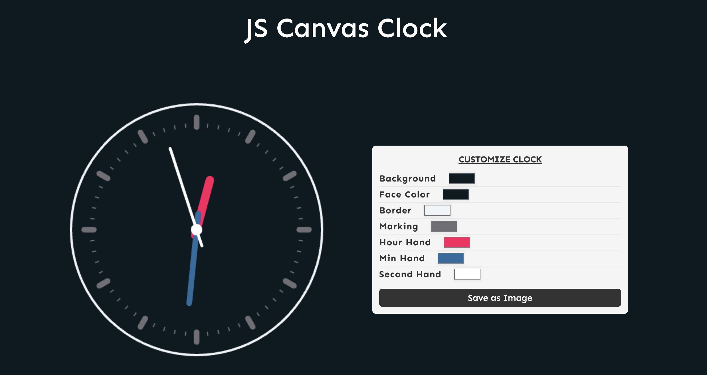

# JS Canvas Clock

A simple yet customizable JavaScript Canvas Clock project.


[Live Demo](https://canvas-clock-js.netlify.app/)

## Overview

The JS Canvas Clock project provides a visually appealing and interactive clock using HTML canvas (web API) and JavaScript. Users can customize the clock's appearance by adjusting various parameters such as background color, face color, border color, marking color, hour hand color, minute hand color, and second hand color.

## Features

- Real-time clock display with hour, minute, and second hands.
- Customizable clock appearance to suit individual preferences.
- User-friendly interface for adjusting color settings.
- Option to save the clock as an image.

## Getting Started

1. Clone the repository or download the source code.

```bash
git clone <repository-url>

```

## Usage

1. Open the clock in your web browser.

2. Use the form on the right to customize the clock's appearance.

3. Adjust the background color, face color, border color, marking color, hour hand color, minute hand color, and second hand color.

4. Click the "Save as Image" button to save the customized clock as an image.

## Technologies Used

- HTML
- Tailwind CSS
- Javascript

## License

This project is licensed under the MIT License.
